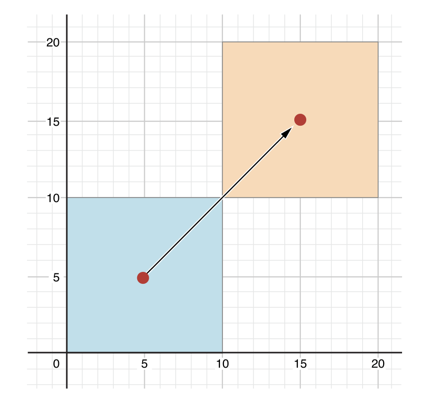

# Properties

[Swift Docs](https://docs.swift.org/swift-book/LanguageGuide/Properties.html)

Stored properties store constant and variable values as part of an instance, whereas computed properties calculate (rather than store) a value. Computed properties are provided by classes, structures, and enumerations. Stored properties are provided only by classes and structures.  
> 저장 프로퍼티는 인스턴스의 상수 및 변수 값을 저장하는 반면 연산 프로퍼티는 (값을 저장하는 대신) 연산합니다. 연산 프로퍼티는 클래스, 구조체 및 열거형에 의해 제공됩니다. 저장 프로퍼티는 클래스와 구조체만 사용 가능합니다. 

Stored and computed properties are usually associated with instances of a particular type. However, properties can also be associated with the type itself. Such properties are known as type properties.  
> 저장 프로퍼티와 연산 프로퍼티는 일반적으로 특정 타입의 인스턴스와 관련되어 있습니다. 하지만 프로퍼티는 타입 자체와도 연관 될 수 있습니다. 이러한 프로퍼티를 타입 프로퍼티라고합니다.

## Stored Properties

### Stored Properties of Constant Structure Instances

If you create an instance of a structure and assign that instance to a constant, you cannot modify the instance’s properties, even if they were declared as variable properties:  
> 구조체 인스턴스를 만들고 해당 인스턴스를 상수에 할당하는 경우 변수 속성으로 선언 된 경우에도 인스턴스의 속성을 수정할 수 없습니다.

```swift
let rangeOfFourItems = FixedLengthRange(firstValue: 0, length: 4)
// this range represents integer values 0, 1, 2, and 3
rangeOfFourItems.firstValue = 6
// this will report an error, even though firstValue is a variable property
``` 

Because rangeOfFourItems is declared as a constant (with the let keyword), it is not possible to change its firstValue property, even though firstValue is a variable property.  
> rangeOfFourItems는 let 키워드를 사용하여 상수로 선언되었기 때문에 firstValue가 변수 속성인 경우에도 firstValue 속성을 변경할 수 없습니다.

This behavior is due to structures being value types. When an instance of a value type is marked as a constant, so are all of its properties.
> 이 동작은 구조체가 value type이기 때문입니다. value type의 인스턴스가 상수로 표시되면 모든 속성도 마찬가지입니다.

The same is not true for classes, which are reference types. If you assign an instance of a reference type to a constant, you can still change that instance’s variable properties.
> 클래스는 reference type이기 때문에, 상수에 할당해도 해당 인스턴스의 변수 속성을 변경할 수 있습니다.

### Lazy Stored Properties

A lazy stored property is a property whose initial value is not calculated until the first time it is used. You indicate a lazy stored property by writing the lazy modifier before its declaration.
> 지연 저장 프로퍼티는 처음 사용할 때까지 초기 값이 연산되지 않는 프로퍼티입니다. lazy 한정자를 앞에 작성함으로써 지연 저장 프로퍼티를 나타냅니다.

Note

You must always declare a lazy property as a variable (with the var keyword), because its initial value might not be retrieved until after instance initialization completes. Constant properties must always have a value before initialization completes, and therefore cannot be declared as lazy.
> 인스턴스 초기화가 완료 될 때까지 초기 값이 검색되지 않을 수 있으므로 항상 lazy 속성을 변수 (var 키워드 사용)로 선언해야합니다. 상수 프로퍼티는 초기화가 완료되기 전에 항상 값을 가져야하므로 lazy로 선언 할 수 없습니다.

Lazy properties are useful when the initial value for a property is dependent on outside factors whose values are not known until after an instance’s initialization is complete. Lazy properties are also useful when the initial value for a property requires complex or computationally expensive setup that should not be performed unless or until it is needed.  
> 지연 프로퍼티는 프로퍼티의 초기 값이 인스턴스의 초기화가 완료 될 때까지 값을 알 수없는 외부 요인에 의존 할 때 유용합니다. 지연 프로퍼티는 프로퍼티의 초기 값에 복잡하거나 연산 비용이 많이 드는 설정이 필요할 때 또는 필요할 때까지 수행해서는 안되는 경우에도 유용합니다.

The example below uses a lazy stored property to avoid unnecessary initialization of a complex class. This example defines two classes called DataImporter and DataManager, neither of which is shown in full:
> 아래 예제는 복잡한 클래스의 불필요한 초기화를 피하기 위해 지연 저장 프로퍼티를 사용합니다. 이 예제는 DataImporter와 DataManager라는 두 개의 클래스를 정의합니다.

```swift
class DataImporter {
/*
DataImporter is a class to import data from an external file.
The class is assumed to take a nontrivial amount of time to initialize.
*/
var filename = "data.txt"
// the DataImporter class would provide data importing functionality here
}

class DataManager {
lazy var importer = DataImporter()
var data = [String]()
// the DataManager class would provide data management functionality here
}

let manager = DataManager()
manager.data.append("Some data")
manager.data.append("Some more data")
// the DataImporter instance for the importer property has not yet been created
``` 

The DataManager class has a stored property called data, which is initialized with a new, empty array of String values. Although the rest of its functionality is not shown, the purpose of this DataManager class is to manage and provide access to this array of String data.
> DataManager 클래스에는 새로운 빈 문자열 값 배열로 초기화되는 data라는 저장 프로퍼티가 있습니다. 나머지 기능은 표시되지 않지만 이 DataManager 클래스의 목적은이 문자열 데이터 배열을 관리하고 액세스를 제공하는 것입니다.

Part of the functionality of the DataManager class is the ability to import data from a file. This functionality is provided by the DataImporter class, which is assumed to take a nontrivial amount of time to initialize. This might be because a DataImporter instance needs to open a file and read its contents into memory when the DataImporter instance is initialized.
> DataManager 클래스의 기능 중 일부는 파일에서 데이터를 가져 오는 기능입니다. 이 기능은 DataImporter 클래스에 의해 제공되며, 초기화하는 데 약간의 시간이 걸린다고 가정합니다. 이는 DataImporter 인스턴스가 초기화 될 때 DataImporter 인스턴스가 파일을 열고 해당 내용을 메모리로 읽어야하기 때문일 수 있습니다.

It is possible for a DataManager instance to manage its data without ever importing data from a file, so there is no need to create a new DataImporter instance when the DataManager itself is created. Instead, it makes more sense to create the DataImporter instance if and when it is first used.
> DataManager 인스턴스는 파일에서 데이터를 가져 오지 않고도 데이터를 관리 할 수 있으므로 DataManager 자체를 만들 때 새 DataImporter 인스턴스를 만들 필요가 없습니다. 대신 DataImporter 인스턴스를 처음 사용하는 경우 생성하는 것이 더 합리적입니다.

Because it is marked with the lazy modifier, the DataImporter instance for the importer property is only created when the importer property is first accessed, such as when its filename property is queried:
> lazy 한정자로 표시되기 때문에 importer 속성에 대한 DataImporter 인스턴스는 importer 속성이 처음 액세스 될 때만 생성됩니다 (예 : filename 속성이 쿼리 될 때).

```swift
print(manager.importer.filename)
// the DataImporter instance for the importer property has now been created
// Prints "data.txt"
``` 

## Computed Properties

In addition to stored properties, classes, structures, and enumerations can define computed properties, which do not actually store a value. Instead, they provide a getter and an optional setter to retrieve and set other properties and values indirectly.
> 저장 프로퍼티 외에도 클래스, 구조체 및 열거형은 실제로 값을 저장하지 않는 연산 프로퍼티를 정의 할 수 있습니다. 대신 다른 프로퍼티의 값을 가져오고 설정 하기위한 getter 및 (선택적) setter를 제공합니다.

```swift
struct Point {
var x = 0.0, y = 0.0
}

struct Size {
var width = 0.0, height = 0.0
}

struct Rect {
var origin = Point()
var size = Size()
var center: Point {
get {
let centerX = origin.x + (size.width / 2)
let centerY = origin.y + (size.height / 2)
return Point(x: centerX, y: centerY)
}
set(newCenter) {
origin.x = newCenter.x - (size.width / 2)
origin.y = newCenter.y - (size.height / 2)
}
}
}

var square = Rect(origin: Point(x: 0.0, y: 0.0),
size: Size(width: 10.0, height: 10.0))
let initialSquareCenter = square.center
square.center = Point(x: 15.0, y: 15.0)
print("square.origin is now at (\(square.origin.x), \(square.origin.y))")
// Prints "square.origin is now at (10.0, 10.0)"
``` 

The Rect structure also provides a computed property called center. The current center position of a Rect can always be determined from its origin and size, and so you don’t need to store the center point as an explicit Point value. Instead, Rect defines a custom getter and setter for a computed variable called center, to enable you to work with the rectangle’s center as if it were a real stored property.
> Rect 구조체는 center라는 연산 프로퍼티도 제공합니다. Rect의 현재 중심 위치는 항상 원점과 사이즈르 통해 확인할 수 있으므로 중심점을 명시적인 Point 값으로 저장할 필요가 없습니다. 대신 Rect는 center라는 연산 프로퍼티 변수에 대한 사용자 정의 getter(읽기) 및 setter(쓰기)를 정의하여 마치 실제 저장된 속성 인 것처럼 사각형의 중심으로 작업 할 수 있도록합니다.

The example above creates a new Rect variable called square. The square variable is initialized with an origin point of (0, 0), and a width and height of 10. This square is represented by the blue square in the diagram below.
> 위의 예는 square라는 새로운 Rect 변수를 만듭니다. square 변수는 원점 (0, 0), 너비와 높이 10으로 초기화됩니다.이 사각형은 아래 다이어그램에서 파란색 사각형으로 표시됩니다.

The square variable’s center property is then accessed through dot syntax (square.center), which causes the getter for center to be called, to retrieve the current property value. Rather than returning an existing value, the getter actually calculates and returns a new Point to represent the center of the square. As can be seen above, the getter correctly returns a center point of (5, 5).
> 그런 다음 점 구문 (square.center)을 통해 square 변수의 center 프로퍼티에 액세스하여 center에 대한 getter를 호출하여 현재 속성 값을 가지고옵니다. 기존 값을 반환하는 대신 getter는 실제로 사각형의 중심을 나타내는 새 Point를 계산하고 반환합니다. 위에서 볼 수 있듯이 getter는 (5, 5)의 중심점을 올바르게 반환합니다.

The center property is then set to a new value of (15, 15), which moves the square up and to the right, to the new position shown by the orange square in the diagram below. Setting the center property calls the setter for center, which modifies the x and y values of the stored origin property, and moves the square to its new position.
> 그런 다음 center 프로퍼티가 (15, 15)의 새 값으로 설정되어 사각형이 아래 다이어그램에서 주황색 사각형으로 표시된 새 위치로 위쪽 및 오른쪽으로 이동합니다. center 속성을 설정하면 center에 대한 setter가 호출되어 저장된 origin 속성의 x 및 y 값을 수정하고 사각형을 새 위치로 이동합니다.




### Shorthand Setter Declaration

If a computed property’s setter doesn’t define a name for the new value to be set, a default name of newValue is used. Here’s an alternative version of the Rect structure that takes advantage of this shorthand notation:
> 연산 프로퍼티의 setter가 설정할 새 값의 이름을 정의하지 않으면 기본 이름 인 newValue가 사용됩니다. 다음은이 약식 표기법을 활용하는 Rect 구조체의 대체 버전입니다.

```swift
struct AlternativeRect {
    var origin = Point()
    var size = Size()
    var center: Point {
        get {
            let centerX = origin.x + (size.width / 2)
            let centerY = origin.y + (size.height / 2)
            return Point(x: centerX, y: centerY)
        }
        set {
            origin.x = newValue.x - (size.width / 2)
            origin.y = newValue.y - (size.height / 2)
        }
    }
}
``` 

### Shorthand Getter Declaration

If the entire body of a getter is a single expression, the getter implicitly returns that expression. Here’s an another version of the Rect structure that takes advantage of this shorthand notation and the shorthand notation for setters:
>  getter의 전체 본문이 단일 표현식 인 경우 getter는 암시 적으로 해당 표현식을 반환합니다. 다음은이 속기 표기법과 setter의 속기 표기법을 활용하는 Rect 구조의 또 다른 버전입니다.

```swift
struct CompactRect {
    var origin = Point()
    var size = Size()
    var center: Point {
        get {
            Point(x: origin.x + (size.width / 2),
                  y: origin.y + (size.height / 2))
        }
        set {
            origin.x = newValue.x - (size.width / 2)
            origin.y = newValue.y - (size.height / 2)
        }
    }
}
``` 

### Read-Only Computed Properties

A computed property with a getter but no setter is known as a read-only computed property. A read-only computed property always returns a value, and can be accessed through dot syntax, but cannot be set to a different value.
> getter가 있지만 setter가없는 연산 프로퍼티를 읽기 전용 연산 프로퍼티라고 합니다. 읽기 전용 연산 프로퍼티는 항상 값을 반환하고 점 구문을 통해 액세스 할 수 있지만 다른 값으로 설정할 수는 없습니다.

Note  

You must declare computed properties—including read-only computed properties—as variable properties with the var keyword, because their value is not fixed. The let keyword is only used for constant properties, to indicate that their values cannot be changed once they are set as part of instance initialization.
> 읽기 전용 연산 프로퍼티를 포함한 연산 프로퍼티는 값이 고정되어 있지 않으므로 var 키워드를 사용하여 변수 속성으로 선언해야합니다. let 키워드는 인스턴스 초기화의 일부로 설정되면 값을 변경할 수 없음을 나타 내기 위해 상수 속성에만 사용됩니다.

You can simplify the declaration of a read-only computed property by removing the get keyword and its braces:
> get 키워드와 해당 중괄호를 제거하여 읽기 전용 연산 프로퍼티의 선언을 단순화 할 수 있습니다.

```swift
struct Cuboid {
    var width = 0.0, height = 0.0, depth = 0.0
    var volume: Double {
        return width * height * depth
    }
}
let fourByFiveByTwo = Cuboid(width: 4.0, height: 5.0, depth: 2.0)
print("the volume of fourByFiveByTwo is \(fourByFiveByTwo.volume)")
// Prints "the volume of fourByFiveByTwo is 40.0"
``` 

This example defines a new structure called Cuboid, which represents a 3D rectangular box with width, height, and depth properties. This structure also has a read-only computed property called volume, which calculates and returns the current volume of the cuboid. It doesn’t make sense for volume to be settable, because it would be ambiguous as to which values of width, height, and depth should be used for a particular volume value. Nonetheless, it is useful for a Cuboid to provide a read-only computed property to enable external users to discover its current calculated volume.
> 이 예제는 너비, 높이 및 깊이 속성이있는 3D 직사각형 상자를 나타내는 Cuboid라는 새 구조를 정의합니다. 이 구조에는 또한 입방체의 현재 볼륨을 계산하고 반환하는 volume이라는 읽기 전용 연산 프로퍼티가 있습니다. 특정 볼륨 값에 대해 너비, 높이 및 깊이 값을 사용해야하는 것이 모호하기 때문에 볼륨을 설정할 수있는 것은 의미가 없습니다. 그럼에도 불구하고, 외부 사용자가 현재 계산 된 볼륨을 발견 할 수 있도록 Cuboid가 읽기 전용 연산 프로퍼티를 제공하는 것이 유용합니다.

## Property Observers

Property observers observe and respond to changes in a property’s value. Property observers are called every time a property’s value is set, even if the new value is the same as the property’s current value.
> 프로퍼티 옵저버는 프로퍼티 값의 변화를 관찰하고 이에 대응합니다. 프로퍼티 옵저버는 새로운 값이 프로퍼티의 현재 값과 동일하더라도 값이 설정 될 때마다 호출됩니다.

You can add property observers in the following places:
> 다음 위치에 프로퍼티 옵저버를 추가 할 수 있습니다.

* Stored properties that you define 
* Stored properties that you inherit
* Computed properties that you inherit

You have the option to define either or both of these observers on a property:
> 프로퍼티에 대해 옵저버를 정의하는 한 두가지의 옵션이 있습니다. 

* willSet is called just before the value is stored.
* didSet is called immediately after the new value is stored.

> willSet은 값이 저장되기 직전에 호출되고, didSet은 값이 저장된 직후 호출 됩니다.

If you implement a willSet observer, it’s passed the new property value as a constant parameter. You can specify a name for this parameter as part of your willSet implementation. If you don’t write the parameter name and parentheses within your implementation, the parameter is made available with a default parameter name of newValue.
> willSet 옵저버를 구현하면 새 프로퍼티 값이 상수 매개 변수로 전달됩니다. willSet 구현의 일부로 이 매개 변수의 이름을 지정할 수 있습니다. 구현 내에서 매개 변수 이름과 괄호를 작성하지 않으면 매개 변수는 기본 매개 변수 이름 인 newValue와 함께 사용할 수 있습니다.

Similarly, if you implement a didSet observer, it’s passed a constant parameter containing the old property value. You can name the parameter or use the default parameter name of oldValue. If you assign a value to a property within its own didSet observer, the new value that you assign replaces the one that was just set.
> 마찬가지로 didSet 옵저버를 구현하면 이전 프로퍼티 값을 포함하는 상수 매개 변수가 전달됩니다. 매개 변수의 이름을 지정하거나 기본 매개 변수 이름 인 oldValue를 사용할 수 있습니다. 자신의 didSet 관찰자 내에서 프로퍼테에 값을 할당하면 할당 한 새 값이 방금 설정된 값을 대체합니다.

Here’s an example of willSet and didSet in action. The example below defines a new class called StepCounter, which tracks the total number of steps that a person takes while walking. This class might be used with input data from a pedometer or other step counter to keep track of a person’s exercise during their daily routine.
> 다음은 willSet 및 didSet의 예입니다. 아래 예제는 사람이 걷는 동안 걷는 총 걸음 수를 추적하는 StepCounter라는 새 클래스를 정의합니다. 이 클래스는 만보계 또는 기타 걸음 수 카운터의 입력 데이터와 함께 사용하여 일상 생활에서 사람의 운동을 추적 할 수 있습니다.

```swift
class StepCounter {
    var totalSteps: Int = 0 {
        willSet(newTotalSteps) {
            print("About to set totalSteps to \(newTotalSteps)")
        }
        didSet {
            if totalSteps > oldValue  {
                print("Added \(totalSteps - oldValue) steps")
            }
        }
    }
}

let stepCounter = StepCounter()
stepCounter.totalSteps = 200
// About to set totalSteps to 200
// Added 200 steps

stepCounter.totalSteps = 360
// About to set totalSteps to 360
// Added 160 steps

stepCounter.totalSteps = 896
// About to set totalSteps to 896
// Added 536 steps
``` 

## Type Properties

Instance properties are properties that belong to an instance of a particular type. Every time you create a new instance of that type, it has its own set of property values, separate from any other instance.
> 인스턴스 프로퍼티는 특정 타입의 인스턴스에 속하는 프로퍼티 입니다. 해당 유형의 새 인스턴스를 만들 때마다 다른 인스턴스와는 별도로 고유 한 프로퍼티 값 집합이 있습니다.

You can also define properties that belong to the type itself, not to any one instance of that type. There will only ever be one copy of these properties, no matter how many instances of that type you create. These kinds of properties are called type properties.
> 또한 해당 타입의 인스턴스가 아닌 타입 자체에 속하는 프로퍼티를 정의 할 수도 있습니다. 생성하는 해당 유형의 인스턴스 수에 관계없이 이러한 프로퍼티의 복사본은 하나만 있습니다. 이러한 종류의 프로퍼티를 타입 프로퍼티라고 합니다.

Type properties are useful for defining values that are universal to all instances of a particular type, such as a constant property that all instances can use (like a static constant in C), or a variable property that stores a value that is global to all instances of that type (like a static variable in C).
> 타입 프로퍼티는 모든 인스턴스가 사용할 수있는 상수 프로퍼티 (예 : C의 정적 상수) 또는 모두에게 전역 값을 저장하는 변수 프로퍼티와 같이 특정 타입의 모든 인스턴스에 보편적인 값을 정의하는 데 유용합니다. 해당 유형의 인스턴스 (예 : C의 정적 변수).

The examples that follow use two stored type properties as part of a structure that models an audio level meter for a number of audio channels. Each channel has an integer audio level between 0 and 10 inclusive.
> 다음 예제에서는 여러 오디오 채널에 대한 오디오 레벨 미터를 모델링하는 구조체의 일부로 두 개의 저장 타입 프로퍼티를 사용합니다. 각 채널에는 0에서 10까지의 정수 오디오 레벨이 있습니다.

The figure below illustrates how two of these audio channels can be combined to model a stereo audio level meter. When a channel’s audio level is 0, none of the lights for that channel are lit. When the audio level is 10, all of the lights for that channel are lit. In this figure, the left channel has a current level of 9, and the right channel has a current level of 7:
> 아래 그림은 이러한 오디오 채널 중 두 개를 결합하여 스테레오 오디오 레벨 미터를 모델링하는 방법을 보여줍니다. 채널의 오디오 레벨이 0이면 해당 채널의 조명이 켜지지 않습니다. 오디오 레벨이 10이면 해당 채널의 모든 표시등이 켜집니다. 이 그림에서 왼쪽 채널의 현재 레벨은 9이고 오른쪽 채널의 현재 레벨은 7입니다.

```swift
struct AudioChannel {
    static let thresholdLevel = 10
    static var maxInputLevelForAllChannels = 0
    var currentLevel: Int = 0 {
        didSet {
            if currentLevel > AudioChannel.thresholdLevel {
                // cap the new audio level to the threshold level
                currentLevel = AudioChannel.thresholdLevel
            }
            if currentLevel > AudioChannel.maxInputLevelForAllChannels {
                // store this as the new overall maximum input level
                AudioChannel.maxInputLevelForAllChannels = currentLevel
            }
        }
    }
}
``` 

The AudioChannel structure defines two stored type properties to support its functionality. The first, thresholdLevel, defines the maximum threshold value an audio level can take. This is a constant value of 10 for all AudioChannel instances. If an audio signal comes in with a higher value than 10, it will be capped to this threshold value (as described below).
> AudioChannel 구조체는 기능을 지원하기 위해 두 개의 저장 타입 프로퍼티를 정의합니다. 첫 번째 thresholdLevel은 오디오 레벨이 취할 수있는 최대 임계 값을 정의합니다. 모든 AudioChannel 인스턴스에 대해 상수 값 10입니다. 오디오 신호가 10보다 높은 값으로 들어 오면이 임계 값으로 제한됩니다 (아래 설명 참조).

The second type property is a variable stored property called maxInputLevelForAllChannels. This keeps track of the maximum input value that has been received by any AudioChannel instance. It starts with an initial value of 0.
> 두 번째 타입 프로퍼티는 maxInputLevelForAllChannels라는 변수 저장 프로퍼티입니다. 이것은 AudioChannel 인스턴스에서받은 최대 입력 값을 추적합니다. 초기 값 0으로 시작합니다.

The AudioChannel structure also defines a stored instance property called currentLevel, which represents the channel’s current audio level on a scale of 0 to 10.
> AudioChannel 구조체는 또한 0부터 10까지의 스케일로 채널의 현재 오디오 레벨을 나타내는 currentLevel이라는 저장된 인스턴스 프로퍼티를 정의합니다.

The currentLevel property has a didSet property observer to check the value of currentLevel whenever it is set. This observer performs two checks:
> currentLevel 프로퍼티에는 설정 될 때마다 currentLevel의 값을 확인하는 didSet 프로퍼티 옵저버가 있습니다. 이 옵저버는 두 가지 검사를 수행합니다.

* If the new value of currentLevel is greater than the allowed thresholdLevel, the property observer caps currentLevel to thresholdLevel.
* If the new value of currentLevel (after any capping) is higher than any value previously received by any AudioChannel instance, the property observer stores the new currentLevel value in the maxInputLevelForAllChannels type property.

```swift
var leftChannel = AudioChannel()
var rightChannel = AudioChannel()

leftChannel.currentLevel = 7
print(leftChannel.currentLevel)
// Prints "7"
print(AudioChannel.maxInputLevelForAllChannels)
// Prints "7"

rightChannel.currentLevel = 11
print(rightChannel.currentLevel)
// Prints "10"
print(AudioChannel.maxInputLevelForAllChannels)
// Prints "10"
``` 
